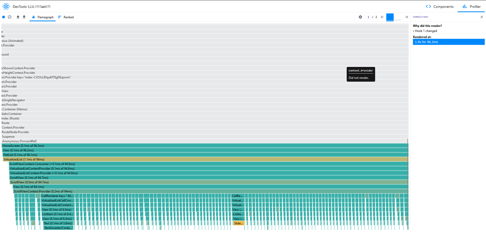
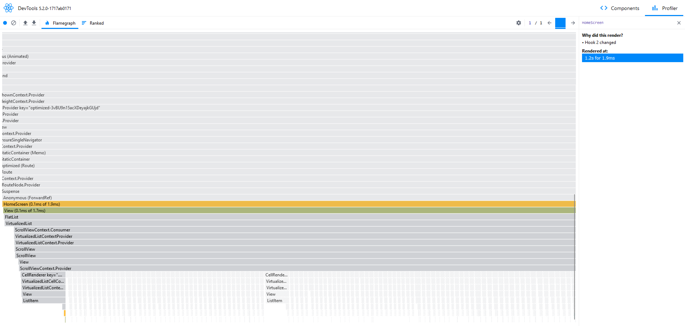

# List Optimization

Once I had to deal with a rendering issue: there was a list of complex components and updating them would cause a massive re-render of everything.
FlatList is incredibly powerful and the problem was solved by changing some of its properties, but I've always wondered if there was a different way to solve that.

Today, I found this blog post: https://brainsandbeards.com/blog/2022-dont-rerender-all-flatlist-items/ and decided to give it a try.
TLDR: create a hashmap, pass a list of ids to FlatList's `data` property, and update the items of the hashmap

This example isn't so complex, but the profiler shows the results: the optimized version does indeed prevent other items from being re-rendered.

Here is a screenshot of the profiler after updating one of the items on the Unoptimized screen:

And now after updating one of the items on the Optimized screen:

Once again, hashmaps are saving the day. This is not to say that FlatList can't do the job with some fine tuning, but this could be an interesting long-term solution to the problem.